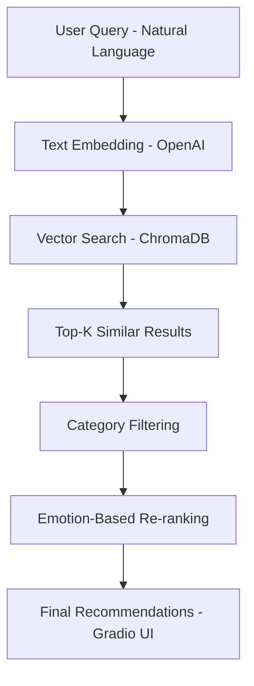

# 📚 Semantic Book Recommender

An NLP-powered book recommendation system that combines **semantic search**, **vector embeddings**, **zero-shot classification**, and **emotion-aware reranking** to recommend books from natural language descriptions instead of simple keyword matching.

---

## 🚀 Demo

🎥 Watch the demo:

(https://drive.google.com/file/d/1LYFbKlUdp_i2leHskgSll9PeFd0CmH5R/view?usp=sharing)

---

## ✨ Features

- 🔍 Semantic search using OpenAI embeddings  
- 🧠 Vector similarity retrieval with ChromaDB  
- 🎭 Emotion-aware reranking using transformer models  
- 🧪 Zero-shot classification for flexible labeling  
- 🗂️ Category filtering (Fiction / Nonfiction)  
- 🖥️ Interactive Gradio UI with clickable recommendations  

---

## 🧠 System Architecture


## ⚙️ How It Works

### 1. Data Preparation
- Cleaned and structured book dataset  
- Extracted descriptions, categories, and metadata  

---

### 2. Embeddings
- Converted descriptions into vector embeddings using OpenAI  
- Enables semantic similarity instead of keyword matching  

---

### 3. Vector Database
- Stored embeddings in ChromaDB  
- Performed fast nearest-neighbor search  

---

### 4. Zero-Shot Classification
- Model: `facebook/bart-large-mnli`  
- Assigns labels without needing a labeled dataset  
- Adds flexibility to classification pipeline  

---

### 5. Emotion Classification
- Model: `j-hartmann/emotion-english-distilroberta-base`  
- Generates emotion scores:
  - joy  
  - sadness  
  - anger  
  - fear  
  - surprise  
  - neutral  

---

### 6. Emotion-Based Re-ranking
- Reorders results based on selected tone:
  - Happy  
  - Sad  
  - Suspenseful  
  - Angry  
  - Surprising  

---

### 7. Frontend
- Built with Gradio  
- Allows:
  - natural language queries  
  - filter selection  
  - clickable book cards  
  - expanded book view  

---

## 🛠️ Tech Stack

| Component | Technology |
|---|---|
| Language | Python |
| Data Processing | Pandas, NumPy |
| Embeddings | OpenAI |
| NLP Models | HuggingFace Transformers |
| Zero-Shot Model | `facebook/bart-large-mnli` |
| Emotion Model | `j-hartmann/emotion-english-distilroberta-base` |
| Framework | LangChain |
| Vector Database | ChromaDB |
| UI | Gradio |

---

## 📂 Project Structure

```text
semantic-book-recommender/
├── data-exploration.ipynb
├── vector-search.ipynb
├── text-classification.ipynb
├── sentiment-analysis.ipynb
├── gradio-dashboard.py
├── requirements.txt
├── cover-not-found.jpg
```
## 📦 Installation

```bash
git clone https://github.com/YOUR_USERNAME/semantic-book-recommender.git
cd semantic-book-recommender
pip install -r requirements.txt
```

## 🔑 Environment Setup

Create a `.env` file:

```env
OPENAI_API_KEY=your_api_key_here
```
## ▶️ Run the App

```bash
python gradio-dashboard.py
```
Open in browser :
```bash
http://127.0.0.1:7860
```
## 📊 Dataset

- Based on a curated dataset of ~7000 books  
- Contains:
  - book titles  
  - descriptions / summaries  
  - categories / genres  
  - additional metadata  

- Used for:
  - semantic search (via embeddings)  
  - emotion classification  
  - filtering and ranking  

> "7k books" kaggle dataset is to be used for this project.

## 💡 What Makes This Project Stand Out

- **Semantic Search (Not Keyword-Based)**  
  Uses embeddings to understand meaning, not just exact word matches  

- **Zero-Shot Classification**  
  Uses `facebook/bart-large-mnli` to classify text without labeled training data  

- **Emotion-Aware Recommendations**  
  Uses `j-hartmann/emotion-english-distilroberta-base` to match books with user mood  

- **Multi-Stage NLP Pipeline**  
  Embeddings → Vector Search → Classification → Emotion Re-ranking  

- **Vector Database Integration**  
  Fast similarity search powered by ChromaDB  

- **Interactive UI (Gradio)**  
  - Natural language search  
  - Filters (category + emotion)  
  - Clickable book cards with expanded view  

- **Production-Style Architecture**  
  Combines multiple ML components into a real-world system instead of isolated notebooks  
